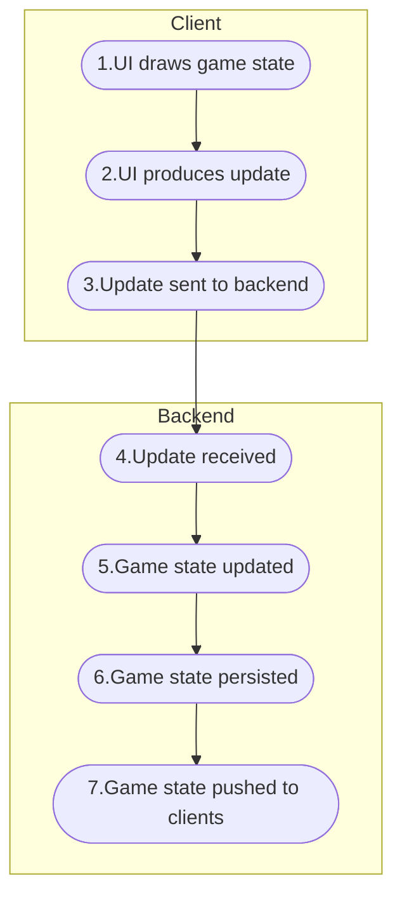

# Game Plumbing Framework (GPF)

**Game Plumbing Framework (GPF)** is a server-authoritative framework for building games and high-performance, real-time applications in C#. It empowers developers with a backend infrastructure and a reactive user interface, allowing them to focus on game logic by inheriting the infrastructure. We call this coding style **"infraless."** and it typically results in the reduction of 80% of code, thereby significantly reducing engineering cost, time to market, and code complexity.

GPF has integrated support with Unity but can be adapted to work with other C# frontends such as Godot Mono, Stride3D, Unreal with UnrealCLR, Blazor (WebAssembly), Xamarin (MAUI), and Avalonia.

## Key Components of GPF

1. **ServerObject:** A server-authoritative construct that manages a portion of the game state.
2. **DataStore:** A global data store where all renderable data resides on the client. GPF automatically synchronizes the DataStore with the world state determined on the server.
3. **ViewBindings:** Highly reusable UI components that subscribe to and draw data from the DataStore.
4. **Test Framework:** A robust framework for developing and testing ServerObjects.

## ServerObjects Primer
_Click the image below to watch the ServerObject primer video on YouTube._
[](https://www.youtube.com/watch?v=IFlMi8HI8vE)


Building a game can be broken down into two fundamental responsibilities:

- **Managing Game State**
- **Managing UI**

Within a synchronous, server-authoritative architecture, the sequence can be further broken down:


All the "backend" functionality is encapsulated in a construct we call a `ServerObject` (SO). When you extend `ServerObject`, you create an object that manages a portion of the game state.

### Examples of ServerObjects

Some components you might write as an SO include:

- **Player Account**
- **Leaderboard**
- **Matchmaker**
- **Match**

The implementation of your SO determines what state it manages and how that state is updated. To customize an SO, you need to:

- Define the SO fields representing the state you want to manage.
- Handle messages by updating those fields, sending messages to other SOs, or both.

Once the SO is functioning, our `ViewBindings` let you easily connect SO fields to the UI, often without needing to write additional code.

### Example: CoinLeaderboardSO

The `CoinLeaderboardSO` [Coin Flipper/ Leaderboard](https://github.com/launch-it-labs/gameplumbingframework/wiki/Coin-Flipper-Leaderboard-Walkthrough) was developed and tested in about 2 hours, requiring only 50 lines of code.

In this example, the state consists of a `Dictionary` called `scores`, which GPF automatically persists and syncs to all relevant clients. The `Handler` functions update the state and/or send messages.

```csharp
// This class is not [Syncable] because the client should not have a copy of this class.
// Even with the id, users cannot access its contents
// No Handlers will have the [FromClient] on them
[Register("coin_leaderboard")]
public class CoinLeaderboardSO : ServerObject
{
    [ExpandData]
    public class LeaderboardRow
    {
        public string username;
        public int score;
    }

    // Use the same SOID to create a singleton
    public static readonly SOID<CoinLeaderboardSO> MainSoid = new("main");

    public const int TOP_SCORE_RETURN_LENGTH = 3;

    public const float MAX_UPDATE_RATE = 0.3f;

    public Dictionary<SOID<CoinPlayerSO>, LeaderboardRow> scores = new();

    public bool scoresChanged;

    public DateTime lastSendTime;

    public bool waitingForRefresh;

    public class SendScore : ServerObjectMessage, ITimeStampReceiver
    {
        public string Username { get; set; }
        public int Score { get; set; }

        public DateTime timestamp { get; set; }
    }

    // Add or update a user's score and username
    private void Handler(SendScore message)
    {
        this.scores[message.Source.GetSOID()] = new LeaderboardRow { username = message.Username, score = message.Score };
        this.scoresChanged = true;
        this.SendScoresToView(message.timestamp);
    }


    public class Refresh : ServerObjectMessage, ITimeStampReceiver
    {
        public DateTime timestamp { get; set; }
    }
    // Send the scores to the view after a delay, this allows for rate limiting and prevents flooding users with updates
    private void Handler(Refresh message)
    {
        this.waitingForRefresh = false;
        this.UpdateView(message.timestamp);
    }

    /// <summary>
    /// This SO is not syncable. Players see the scores through a separate, sysncable, view SO
    /// This allows us to rate limit the updates that get sent to players
    /// It also allows us to keep player secret data hidden
    /// </summary>
    private void SendScoresToView(DateTime timestamp)
    {
        // Limit the rate that we update the viewable LeaderBoard to conserve bandwidth
        var secondsSinceLastUpdate = (timestamp - this.lastSendTime).TotalSeconds;
        if (secondsSinceLastUpdate >= MAX_UPDATE_RATE)
        {
            this.UpdateView(timestamp);
        }
        else
        {
            this.RefreshAfterDelay();
        }
    }

    /// <summary>
    /// Calculated the latest top scores and update all the player's top scores views
    /// </summary>
    private void UpdateView(DateTime timestamp)
    {
        // Send the top scores to the view
        var topScores = this.FindTopScores();
        var topScoresSoid = new SOID<CoinTopScoresSO>(this.Id);
        this.Send(topScoresSoid, new CoinTopScoresSO.SetTopScores { Scores = topScores });
        this.lastSendTime = timestamp;
        this.scoresChanged = false;
    }

    /// <summary>
    /// To prevent flooding, we want to limit how frequently we update the top score view
    /// Schedule a refresh for later, or wait for the refresh if it is already scheduled
    /// </summary>
    private void RefreshAfterDelay()
    {
        if (!this.waitingForRefresh && this.scoresChanged)
        {
            this.Send(this.Id, new Refresh(), MAX_UPDATE_RATE);
            this.waitingForRefresh = true;
        }
    }

    private LeaderboardRow[] FindTopScores()
    {
        var count = TOP_SCORE_RETURN_LENGTH < this.scores.Count ? TOP_SCORE_RETURN_LENGTH : this.scores.Count;

        var topScores = this.scores.OrderByDescending(entry => entry.Value.score).Take(count).ToArray();
        var result = new LeaderboardRow[count];
        for (var i = 0; i < topScores.Length; i++)
        {
            result[i] = topScores[i].Value;
        }
        return result;
    }
}
```
# Conclusion 

When writing SOs, developers focus can focus on server authoritative logic because GPF automatically handles: 

- Persistence
- Syncing state to subscribed clients
- Update UI as state changes

GPF also makes developing SOs easy in a number of ways:

- `MockCloud` enables `SOs` to be developed within Unity and without waiting for deploys
- `MockCloud` enables the debugger to oversee the full stack, so breakpoints in your `ServerObjects` can be triggered from gameplay
- `SOs` can be tested independently
- Auto-generate diagrams to illustrate how they are interact
- `SO's` can be deployed to a serverless AWS backend through the Unity Editor
- UI inspector that uses autocomplete to find game state

Finally, GPF handles deployment for you by including a stack management panel from inside of Unity.  Developers can easily spin up a stack for their branch and test multiplayer functionality with others.

# Welcome to the Game Plumbing Framework Wiki!

**Game Plumbing Framework (GPF)** is a server-authoritative framework for building games and high-performance, real-time applications in C#. It empowers developers with a backend infrastructure and a reactive user interface, allowing them to focus on game logic by inheriting the infrastructure. We call this coding style **"infraless."** 

GPF has integrated support with Unity but can be adapted to work with other C# frontends such as Godot Mono, Stride3D, Unreal with UnrealCLR, Blazor (WebAssembly), Xamarin (MAUI), and Avalonia.

## Key Components of GPF

1. **ServerObject:** A server-authoritative construct that manages a portion of the game state.
2. **DataStore:** A global data store where all renderable data resides on the client. GPF automatically synchronizes the DataStore with the world state determined on the server.
3. **ViewBindings:** Highly reusable UI components that subscribe to and draw data from the DataStore.
4. **Test Framework:** A robust framework for developing and testing ServerObjects.

## ServerObjects Primer
_Click the image below to watch the ServerObject primer video on YouTube._
[](https://www.youtube.com/watch?v=IFlMi8HI8vE)


Building a game can be broken down into two fundamental responsibilities:

- **Managing Game State**
- **Managing UI**

Within a synchronous, server-authoritative architecture, the sequence can be further broken down:


All the "backend" functionality is encapsulated in a construct we call a `ServerObject` (SO). When you extend `ServerObject`, you create an object that manages a portion of the game state.

### Examples of ServerObjects

Some components you might write as an SO include:

- **Player Account**
- **Leaderboard**
- **Matchmaker**
- **Match**

The implementation of your SO determines what state it manages and how that state is updated. To customize an SO, you need to:

- Define the SO fields representing the state you want to manage.
- Handle messages by updating those fields, sending messages to other SOs, or both.

Once the SO is functioning, our `ViewBindings` let you easily connect SO fields to the UI, often without needing to write additional code.

### Example: CoinLeaderboardSO

The `CoinLeaderboardSO` [Coin Flipper/ Leaderboard](https://github.com/launch-it-labs/gameplumbingframework/wiki/Coin-Flipper-Leaderboard-Walkthrough) was developed and tested in about 2 hours, requiring only 50 lines of code.

In this example, the state consists of a `Dictionary` called `scores`, which GPF automatically persists and syncs to all relevant clients. The `Handler` functions update the state and/or send messages.

```csharp
// This class is not [Syncable]
// Even with the id, users cannot access its contents
// No Handlers will have the [FromClient] on them
[Register("coin_leaderboard")]
public class CoinLeaderboardSO : ServerObject
{
    [ExpandData]
    public class LeaderboardRow
    {
        public string username;
        public int score;
    }

    // Use the same SOID to create a singleton
    public static readonly SOID<CoinLeaderboardSO> MainSoid = new("main");

    public const int TOP_SCORE_RETURN_LENGTH = 3;

    public const float MAX_UPDATE_RATE = 0.3f;

    public Dictionary<SOID<CoinPlayerSO>, LeaderboardRow> scores = new();

    public bool scoresChanged;

    public DateTime lastSendTime;

    public bool waitingForRefresh;

    public class SendScore : ServerObjectMessage, ITimeStampReceiver
    {
        public string Username { get; set; }
        public int Score { get; set; }

        public DateTime timestamp { get; set; }
    }

    // Add or update a user's score and username
    private void Handler(SendScore message)
    {
        this.scores[message.Source.GetSOID()] = new LeaderboardRow { username = message.Username, score = message.Score };
        this.scoresChanged = true;
        this.SendScoresToView(message.timestamp);
    }


    public class Refresh : ServerObjectMessage, ITimeStampReceiver
    {
        public DateTime timestamp { get; set; }
    }
    // Send the scores to the view after a delay, this allows for rate limiting and prevents flooding users with updates
    private void Handler(Refresh message)
    {
        this.waitingForRefresh = false;
        this.UpdateView(message.timestamp);
    }

    /// <summary>
    /// This SO is not syncable. Players see the scores through a separate, sysncable, view SO
    /// This allows us to rate limit the updates that get sent to players
    /// It also allows us to keep player secret data hidden
    /// </summary>
    private void SendScoresToView(DateTime timestamp)
    {
        // Limit the rate that we update the viewable LeaderBoard to conserve bandwidth
        var secondsSinceLastUpdate = (timestamp - this.lastSendTime).TotalSeconds;
        if (secondsSinceLastUpdate >= MAX_UPDATE_RATE)
        {
            this.UpdateView(timestamp);
        }
        else
        {
            this.RefreshAfterDelay();
        }
    }

    /// <summary>
    /// Calculated the latest top scores and update all the player's top scores views
    /// </summary>
    private void UpdateView(DateTime timestamp)
    {
        // Send the top scores to the view
        var topScores = this.FindTopScores();
        var topScoresSoid = new SOID<CoinTopScoresSO>(this.Id);
        this.Send(topScoresSoid, new CoinTopScoresSO.SetTopScores { Scores = topScores });
        this.lastSendTime = timestamp;
        this.scoresChanged = false;
    }

    /// <summary>
    /// To prevent flooding, we want to limit how frequently we update the top score view
    /// Schedule a refresh for later, or wait for the refresh if it is already scheduled
    /// </summary>
    private void RefreshAfterDelay()
    {
        if (!this.waitingForRefresh && this.scoresChanged)
        {
            this.Send(this.Id, new Refresh(), MAX_UPDATE_RATE);
            this.waitingForRefresh = true;
        }
    }

    private LeaderboardRow[] FindTopScores()
    {
        var count = TOP_SCORE_RETURN_LENGTH < this.scores.Count ? TOP_SCORE_RETURN_LENGTH : this.scores.Count;

        var topScores = this.scores.OrderByDescending(entry => entry.Value.score).Take(count).ToArray();
        var result = new LeaderboardRow[count];
        for (var i = 0; i < topScores.Length; i++)
        {
            result[i] = topScores[i].Value;
        }
        return result;
    }
}
```
# Conclusion 

When writing SOs, developers focus can focus on server authoritative logic because GPF automatically handles: 

- Persistence
- Syncing state to subscribed clients
- Update UI as state changes

GPF also makes developing SOs easy in a number of ways:

- `MockCloud` enables `SOs` to be developed within Unity and without waiting for deploys
- `MockCloud` enables the debugger to oversee the full stack, so breakpoints in your `ServerObjects` can be triggered from gameplay
- `SOs` can be tested independently
- Auto-generate diagrams to illustrate how they are interact
- `SO's` can be deployed to a serverless AWS backend through the Unity Editor
- UI inspector that uses autocomplete to find game state

Finally, GPF handles deployment for you by including a stack management panel from inside of Unity.  Developers can easily spin up a stack for their branch and test multiplayer functionality with others.
[Component Overview](https://github.com/launch-it-labs/gameplumbingframework/wiki/Major-GPF-Components/)
[Get Started Now!](https://github.com/launch-it-labs/gameplumbingframework/wiki/HelloWorld-Tutorial-part-1:-Implementing-ServerObjects/)
