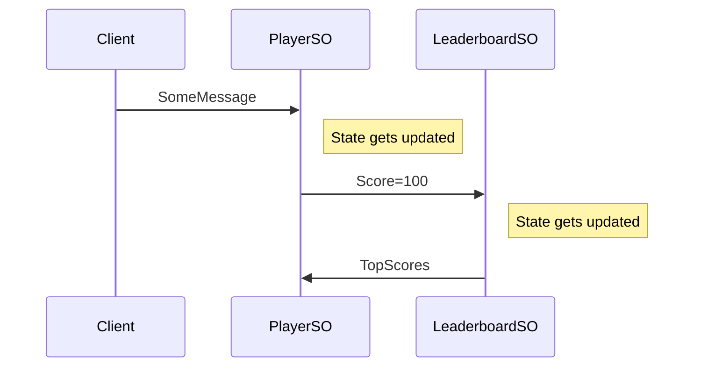

import Video from "../../components/Video";

In GPF, objects responsible for game-state are called `ServerObjects`. Although we provide many examples of `ServerObjects` (SOs), the strength of GPF is you get to design and build your own so you never find yourself held hostage to a third party's assumptions about how your game should work.

<center>
<Video videoTitle="serverobjectguide" youtubeID="61h-qyAyz08" />
</center>

### Examples

Examples of parts of the game state you might write a `ServerObject` for include player, player profile, leaderboard, map, room, lobby, table (for card games), and match.

### Develop in Unity

Although SOs are eventually deployed to a remote cloud, because we built a simulated cloud in Unity you can test and develop SOs easily.

### Powerful Yet Simple

SOs are simple to write because the only need to worry about the state of the object they represent, and how messages change that state. GPF handles everything else for you, including:

- Persistence
- Networking
- Messaging
- Scalability
- Security

### Automatically Kept Insync

GPF makes sure that UI is always up to date with the state of all relevent SOs. For example, when another player's score makes it to the leaderboard, every other player's client will be updated automatically.

### Reactive

SOs send and receive messages to each other and to the `Client`. They only run code as a reaction to an incoming message. Reactions include state changes and sending out messages.

For example, let’s examine how a Player and a Leaderboard `ServerObject` ( `PlayerSO` and `LeaderboardSO`) could interact.



- As the player plays your game, the client translates user gestures into custom messages and sends them to the `PlayerSO`.
- As a result of these messages, the `PlayerSO’s` state is updated.
- Because the client syncs to `PlayerSO` in the controller, the state of `PlayerSO` is automatically synced back to the client into the UI by game plumbing framework.
- Also as a result of these messages, as the score is updated, it is sent to the `LeaderboardSO`.
- The `LeaderboardSO` updates its dictionary of player scores and sends a list of the top scores back to the `PlayerSO`
- The `PlayerSO` updates his local leaderboard data structure and that update is synced down to the client UI.

We have an example of this interaction within the Coin starter project. Just run the `CoinTest` from Test Runner and right-click on open source code to see the code.

Messages are received and processed using handlers. Handlers are functions defined in your SO's with the name `Handler` that accept a `ServerObjectMessage` as a parameter.

Handlers can have the attribute `[FromClient]` which allows that message to come from a client that is synced to the SO. Without `[FromClient]` a `Handler` will only process messages from other SO's.

Here is a `Handler` from `CoinLeaderboardSO` that handles the `SendScore` message from a `CoinPlayerSO`, by adding that score to it’s own score list, re-order the scores, and send the top ones back to the player that messaged it.

```csharp
public class SendScore : ServerObjectMessage
{
    public string username;
    public int score;
}

void Handler(SendScore message)
{
    scores[message.evt.source] = new Tuple<string, int>(message.username, message.score);
    var topScores = FindTopScores();
    Send(message.evt.source, new TopScores { scores = topScores });
}
```

`SendScore` inherits from `ServerObjectMessage`, giving it a reference to `evt`. `evt` includes:

- `source`: the name of the SO that sent the update.

- `serverTimestamp`: the time the update was processed on the server.

  Handlers can do 2 things:

  1. Alter the state of the SO.
  2. Send messages to other SOs.

  If your client knows the [direct](/security) name of an SO and that SO is `Syncable`, then the client can Sync to it, which is to say `Syncer` will provide the client with an up to date copy of the SO.

  SO’s are not `Syncable` by default. To make them `Syncable` you need to add the `[Syncable]` attribute to the SO.

  In the Coin starter project, the CoinPlayerSO is syncable.

```csharp
[Syncable]
[Register("coin_player")]
public class CoinPlayerSO : ServerObject
```

The CoinLeaderBoardSO is not syncable. Clients cannot sync to it, even if they know the direct name.

```csharp
[Register("coin_leaderboard")]
public class CoinLeaderboardSO : ServerObject
```

### Attributes

Here are attributes used to decorate an SO class:

##### [Register("exampleSOName")]

Mandatory. Every SO needs to map to some text used to identify it.

##### [Syncable]

Optional. Signifies that these SOs can be Synced to by the client.

##### [DataStorePath("sync.coin_players")]

Optional. Allows UI to Sync to an SO, and sets the path by which they do that. All objects of the type will be placed under that path, then the objects id.

### Serialization

As a part of the build script, GPF compiles serializers for your SOs, and messages for you.  
Please refer to [Message Pack’s documentation](https://github.com/msgpack/msgpack-cli/wiki) to gain an understanding of how to control serialization.

### Constraints

There are 3 major constraints you need to be aware of as you develop your own SOs.

1.They need to run the same way against a `.NET Standard` compiler as they do against a `.NET Core 3.1` compiler. This is because the server version is running in a .`NET Core 3.1` environment but we are syncing to the client by running the same updates against a client version of the SO. Fortunately, whenever you change an SO and come back to Unity, we automatically kick off the `.NET Core 3.1` compile so you will be able to catch any code that doesn’t compile in both environments.

2.Don’t use threading or `async` processing within the SO. This will not result in any performance gains as the SO runs in a highly virtualized container. You will be charged for all of the clock time it takes to run SO updates. To keep costs down, instead of an SO waiting for something to occur, think about ways you can make that occurrence send a message to your SO.

3.Because SO’s are routinely rebuilt based on their updates. You can not assign the results of a non-deterministic function to a field that is serialized. Non-deterministic functions refer to `Random`, `DateTime.Now`, `System.Guid`, or anything else where the outputs are not purely a function of the inputs.

This code WILL NOT work as intended:

```csharp
public class Flip : ServerObjectMessage {}
[FromClient]
void Handler(Flip message)
{
    Random rand = new Random();
    var isHeads = rand.Next(2) == 0;
    if (isHeads)
        currentStreak++;
}
```

In the above code, the `CoinPlayerSO` would add to it's current streak of heads based on a random bool. During the rebuilding process, the non-deterministic nature of Random.Next() means isHeads could end up different. As a result `currentStreak` will have different values at different times. Instead you can accomplish the same thing by having the SO send itself the `isHeads` through an update:

```csharp
public class Flip : ServerObjectMessage {}
[FromClient]
void Handler(Flip message)
{
    Random rand = new Random();
    var isHeads = rand.Next(2) == 0;
    Send(ID, new FlipResult { isHeads = isHeads });
}
public class FlipResult : ServerObjectMessage
{
    public bool isHeads;
}
void Handler(FlipResult message)
{...}
```

Now `currentStreak` is updated based on the message, and since the SOs are built by replaying the messages, everything works as intended. Other non-deterministic values can be dealt with in the same way.
