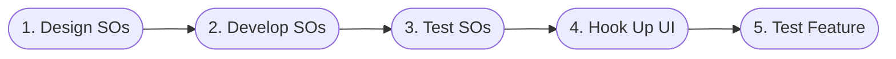

GFP streamlines the process of building features. It emphasizes testability and enforces a clean separation between state and view. The sequence of steps below provides guidance for breaking up a feature into tasks.

 
 

 

| Phase                        | Resource  | Description                                                                                                                                                                                                                                                                                                                                                                                             |
| ---------------------------- | --------- | ------------------------------------------------------------------------------------------------------------------------------------------------------------------------------------------------------------------------------------------------------------------------------------------------------------------------------------------------------------------------------------------------------- |
| 1.&nbsp;Design&nbsp;SOs      | Architect | The major nouns of your domain are good candidates to be `ServerObjects`. Design out what state each SO is responsible for, the messages they receive, the payloads within those messages, and how handling those messages should impact that SO's state. Your own design document can be laid out with sequence diagrams and tables like our [Leaderboard Game Walkthrough](/leaderboard_walkthrough). |
| 2.&nbsp;Develop&nbsp;SOs     | Sr. Dev   | Create unit tests to check whether the SOs implement their design correctly. Run these tests against the simulated backend and build out SOs until all tests pass. [See ServerObject Guide](/serverobject_guide).                                                                                                                                                                                   |
| 3.&nbsp;Test&nbsp;SOs        | Dev       | Once your tests pass locally you will want to deploy your `ServerObjects` and test them against your unit tests against the real cloud.                                                                                                                                                                                                                                                                 |
| 4.&nbsp;Hook&nbsp;Up&nbsp;UI | UI Dev    | Once your SOs are working correctly, it's time to Hook them up to UI. At this point, the feature can be handed off to UI Developers for completion. Use the supplied `ViewBindings` and the inspector panel bind to the properties on the SOs you want the UI to reflect. [See Hooking Up UI](/hooking_up_ui)                                                                                       |
| 5.&nbsp;Test&nbsp;Feature    | UI Dev    | Once your UI is hooked up, you can create several test accounts using the test account UI to help you with play-through tests. Our test account system lets you load old accounts or create new ones when testing locally. It also allows you to enable and disable progress saving, so you can create test accounts that target different parts of your game.                                          |
